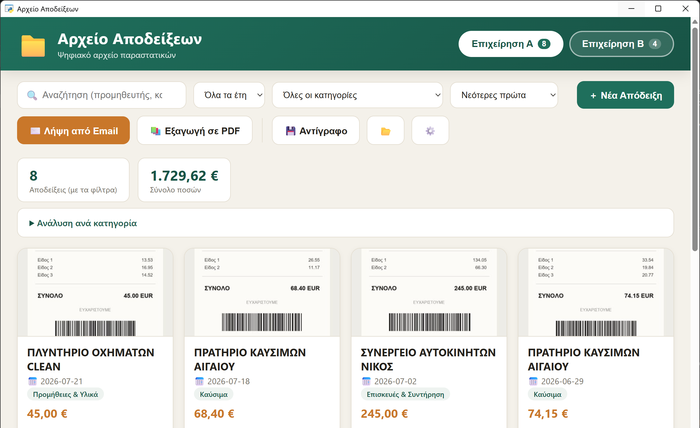
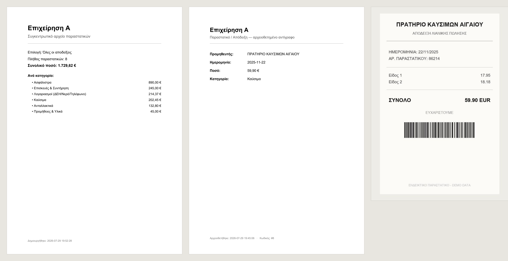

# Receipts Archive · Αρχείο Αποδείξεων 🗂️

A small offline desktop application that turns a shoebox of paper receipts into a
searchable digital archive — and produces the single PDF an accountant or a tax
office actually asks for.

Built for real day-to-day use by two small businesses in Greece, so the interface
is in Greek. It runs entirely on the local machine: no cloud, no account, no
telemetry.

> **Tech:** Python · Flask · SQLite · pywebview (native window) · Pillow ·
> reportlab · pikepdf · PyInstaller



The archive for one business: search, year and category filters, running totals,
and every receipt as a thumbnail of the original document.



The one-click export, as handed to an accountant: a summary cover with totals and
per-category subtotals, then — for every receipt — a details page followed by the
original scan merged in behind it.

> Screenshots use generated sample data. No real receipt, vendor or amount appears
> anywhere in this repository.

---

## Why it exists

Small businesses accumulate hundreds of fuel, parts and utility receipts a year.
At tax time someone has to find them, add them up, and hand over an organised
bundle. This app makes that a one-click job:

- **Capture** — photograph or scan a receipt; it's converted to PDF and filed
  automatically by business and by year.
- **Ingest from email** — connects to a mailbox over IMAP, pulls PDF/image
  attachments, and holds them in a review queue so nothing is filed blindly.
- **Find** — full-text search over vendor, category and notes, with year and
  category filters and per-category spend totals.
- **Export** — one consolidated PDF: a summary cover page with totals and
  per-category subtotals, followed by every matching receipt with its details.

## Features

| | |
|---|---|
| 📷 **Three ways to add a receipt** | file picker, drag & drop, or paste a screenshot with `Ctrl+V` |
| 🔁 **Duplicate detection** | warns when a receipt with the same date and amount already exists |
| 🧠 **Category memory** | suggests the category last used for the same vendor |
| ✉️ **IMAP sync** | Gmail / Outlook / Yahoo presets, per-business credentials, tracks seen messages so nothing is imported twice |
| 📄 **Per-receipt PDF** | a clean details page merged with the original scan |
| 📚 **Bulk PDF** | everything currently filtered, in one file with a summary cover |
| 💾 **One-click backup** | copies the whole data folder to a USB stick or any folder |
| 🇬🇷 **Greek-first** | Greek UI, Greek number/currency formatting, and Unicode-safe sorting and search (SQLite's `LOWER()` does not handle Greek, so matching is done in Python) |

## Design notes

A few decisions worth calling out:

- **Local-first by construction.** Flask binds to `127.0.0.1` on a random free
  port, and the UI is a native window via pywebview rather than a browser tab.
  Nothing listens on the network.
- **Credentials never touch the database.** The IMAP password is stored in the
  Windows Credential Locker through `keyring` (DPAPI-encrypted per user account).
  The database holds only host, port, username and folder — so a copied data
  folder or a stolen backup exposes no credentials.
- **The data folder is the backup.** All state — SQLite database, filed PDFs,
  thumbnails, exports — lives in one folder under `Documents`. Copying that
  folder is a complete backup; there is no hidden state elsewhere.
- **Receipts are filed by the date on the receipt**, not the date they were
  entered, so a receipt scanned in January still lands in the previous tax year.
- **Originals are preserved.** Images are converted to PDF and the original pages
  are merged into every export, so the archived copy is always the real document.

## Running it

Requires Python 3.10+ on Windows.

```bat
git clone https://github.com/tourlaza/receipts-archive.git
cd receipts-archive
Εγκατάσταση.bat          ..... creates .venv and installs dependencies (first time only)
Άνοιγμα Αρχείου.vbs      ..... starts the app with no console window
```

Or manually:

```bat
python -m venv .venv
.venv\Scripts\pip install -r requirements.txt
.venv\Scripts\pythonw app.py
```

**Building a standalone `.exe`** (no Python needed on the target machine):

```bat
.venv\Scripts\pip install pyinstaller
.venv\Scripts\pyinstaller build.spec
```

### Configuration

Business names are the one thing you'll want to change. They live in a single
constant near the top of [`app.py`](app.py):

```python
BUSINESSES = {
    "business_a": "Επιχείρηση Α",
    "business_b": "Επιχείρηση Β",
}
```

Add or remove entries freely. The key on the left is used in the database and in
folder names — changing it after receipts exist will hide the old ones; the
display name on the right is safe to change at any time.

## Where data is stored

```
Documents\Αρχείο Αποδείξεων\
├── receipts.db          SQLite database
├── Αποδείξεις\          filed receipts, by business and year
├── Προς Έλεγχο\         email attachments awaiting review
└── Εξαγωγές PDF\        generated PDFs
```

Nothing is written inside the repository.

## Platform

Windows-only in practice: the launcher is a `.vbs` script, `os.startfile()` is
used to open files and folders, and the PDF export looks for Arial in the Windows
font directory for Greek glyph coverage. The Flask/SQLite core is portable; the
shell integration is not.

## Documentation

[`docs/ΟΔΗΓΙΕΣ.md`](docs/ΟΔΗΓΙΕΣ.md) — the end-user manual, in Greek, written for
non-technical users.

## Author

**Lazaros Aggelos Touretzoglou** — Computer Engineer

## License

MIT — see [LICENSE](LICENSE).
